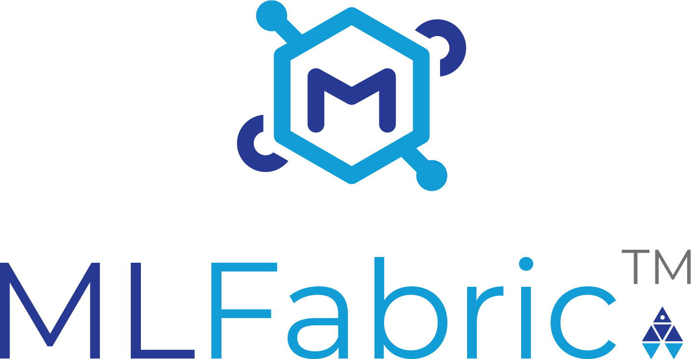
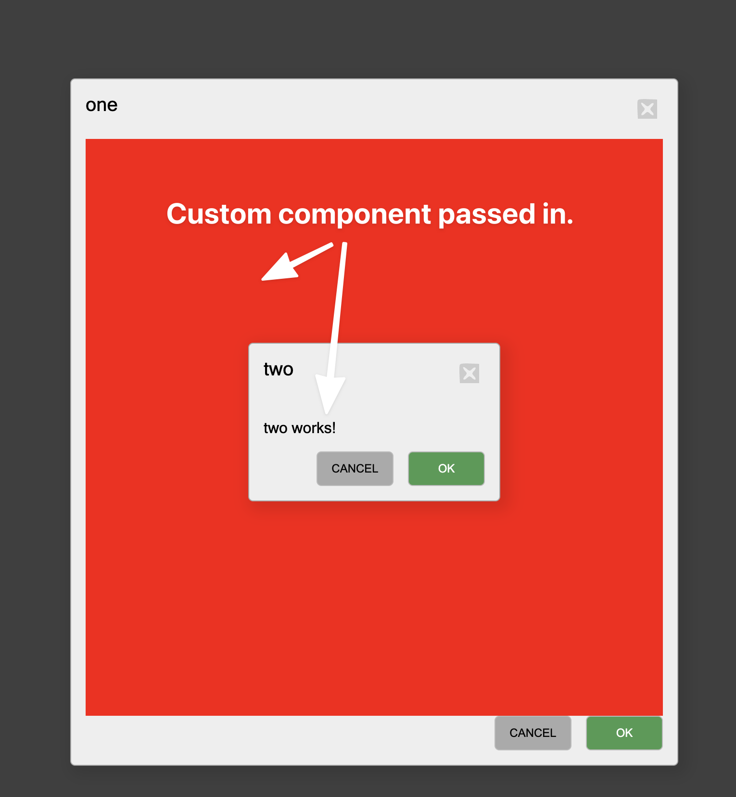

> MLFabric is a model operationalization and productionization platform-as-a-service 
> built by the Machine Learning Team at Moody's Analytics.

# Senior DevOps Engineer Job Description

We want you to join our team and contribute your expertise to designing and building innovative applications to meet evolving requirements, improve our client-facing applications, and design persuasive technologies with behavioral science.
We are in search of a self-motivated and versatile developer with the ability to work in an energetic and interactive environment. You must be a self-starter with a passion for crafting innovative software for a diverse user community. You will regularly learn and implement new technologies, and play an active role in developing, as well as managing your own projects.

### ABOUT MOODY'S ANALYTICS MACHINE LEARNING TEAM

We are a team that creates and delivers machine learning models and applications for the financial services industry. At a high level, we ingest millions of news articles and other various data sources and process the data through pipelines to produce results such as entity recognition, sentiment analysis, credit adversity, and more.
As a full-stack engineer you will be responsible for creating and maintaining user experiences through web applications and API’s that interact with our growing data sources.
Interested in machine learning? Take advantage of our growing team's collective knowledge and learn as you go. We fully embrace cross-training and continuous learning.

### JOB RESPONSIBILITIES

* Design and development of web applications using Angular 10+.
* Designing, developing, and integrating APIs using TypeScript using Nest.js.
* Managing projects from conception to finished product, or with a team.
* Contribute to the growth of the team and continuous learning.

### JOB REQUIREMENTS

* Be ready, willing, and able to work in a fast-paced environment.
* Proficiency in HTML5, CSS3, JavaScript(ES6+) and TypeScript.
* Knowledge and experience working with SPA frameworks (Angular 10+).
* Comfortable knowledge/experience with git, docker, web servers, and databases and node.js.
* Capable of implementing Responsive / Adaptive web designs (cross-browser compatibility)
* Strong communication and problem-solving skills with the ability to discuss projects with colleagues who have little technical knowledge of digital production techniques and tools.

---

# Full Stack Interview Take Home Project

The purpose of this exercise is to demonstrate core competencies using Angular.

We will create a re-usable component library and publish it to npmjs.org.

Once the component is created we will then be able to `npm install` it in a separate 
angular environment and display it.

## 1. Library Requirements

Create a modal manager that allows you to `open(..)` multiple modal dialogs.

* Expose a service with an `open(..)` and `close(..)` method.
* Support more than one modal dialog being open at any time.
* Allow the caller to pass in a component reference which is dynamically injected.
* Return an Observable that will emit button click events.
* Should have basic scss styling.
* Test coverage should cover the service and component layers.

## 2. Example Application Requirements

Once you've published your angular component library module install it in a new angular project.

* Import the module.
* Open multiple modal dialogs in your `AppComponent` constructor.
* Use `setTimeout` or `setInterval` to randomly open and close multiple modal dialogs.
* Create a few components and pass them to your `open(..)` method of your modal service.

# Expectations

* Clean and well structured code.
* Re-usable and modular implementations.
* Single command to create and destroy the entire stack.
* Results to be distributed as a git repository.

---

Copyright © 2022 Moody's Analytics, Inc. All rights reserved.

